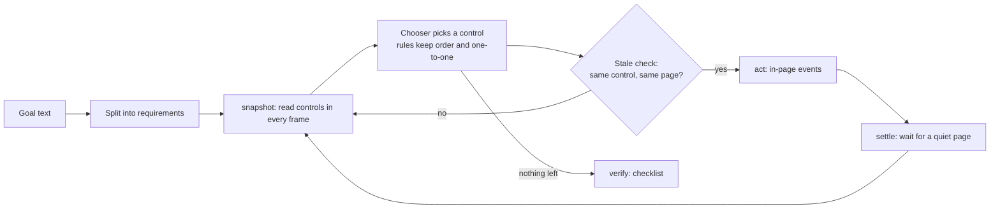
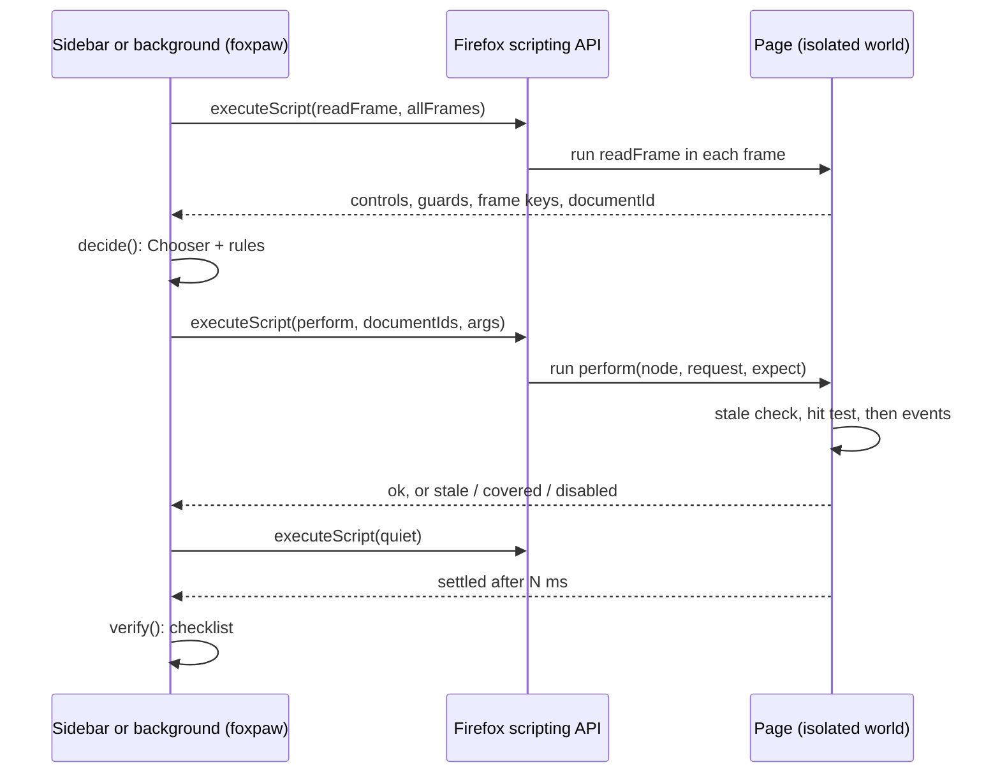
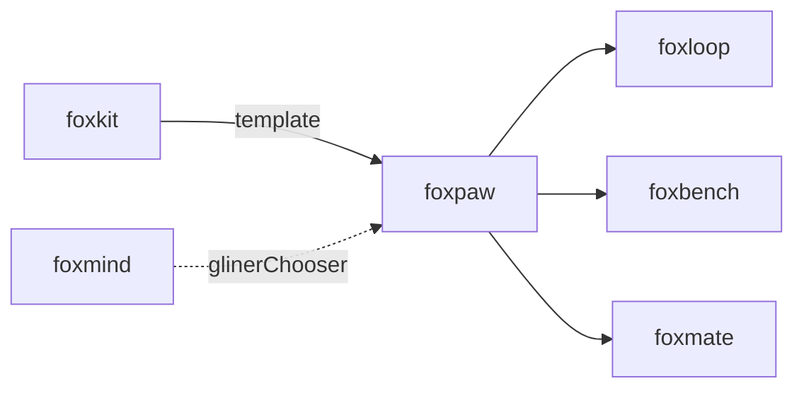

# foxpaw

Read a web page, act on it like a person, and check the result, from a Firefox extension.

foxpaw is the "hand" of a browser agent. It reads the controls on a page,
clicks and types through in-page events, refuses to act when the page changed
after the decision, and then checks the result. It decides with rules and a
pluggable `Chooser`. The default chooser needs no model and no download.

## Install

```bash
npm i foxpaw
```

## Example

This code runs as written in a Firefox extension page or background script
that you bundle, for example with esbuild. The extension needs the `scripting`
and `tabs` permissions and host access to the page:

```js
import { runTask, ruleChooser } from "foxpaw";

const [tab] = await browser.tabs.query({ active: true, currentWindow: true });
const result = await runTask(tab.id, "email: sam@example.com, accept the terms", {
  chooser: ruleChooser(),
});
console.log(result.status, result.verified);
for (const check of result.checks) console.log(check.ok ? "ok" : "no", check.part, "-", check.evidence);
```

On a sign-up form, the result looks like this:

```text
done true
ok email: sam@example.com - Email: sam@example.com
ok accept the terms - I accept the terms
ok Form sent - the run sent the form it filled
```

To try it without writing code, build the demo extension and load it:

```bash
pnpm install
pnpm build:ext
```

In Firefox, open `about:debugging#/runtime/this-firefox`, click **Load
Temporary Add-on**, and choose `dist-ext/manifest.json`. Click the toolbar
button to open the sidebar. Type a goal for the current tab, then click **Run**.

## Use cases

| Who | What they build | How foxpaw helps |
|---|---|---|
| Builders of form-filling helpers | An extension that fills a job or travel form from saved details | `runTask` matches each value to the right field, picks autocomplete options and dates, and reports what it filled. |
| Accessibility tool makers | A voice or switch control that says "set the cabin to Business" | `snapshot` gives each control's role, accessible name and state. `act` does the click or the typing for the user. |
| QA testers | Smoke tests that fill a form in real Firefox and assert the outcome | `verify` returns a checklist and flags error, empty and captcha pages, so a test fails for the right reason. |
| Other agents that need a reliable hand | A planner (foxloop, or your own LLM loop) that decides what to do | `act` runs only on the exact document the planner saw. When the control, its row or the page changed after the decision, it returns `stale` and does not click. |
| Data entry teams | A tool that types rows from a sheet into a web form, one row at a time | One goal per row. Each run says `verified` or lists the field that did not take the value. |
| Benchmark authors | A foxbench adapter that scores foxpaw against other agents | `runTask` returns the same result shape as foxpilot's `run_task`: status, verified, checks and steps. |

## How it works



1. `parseGoal` splits the goal into requirements: values (`email: sam@example.com`),
   dates (`depart December 3, 2026`) and settings (`accept the terms`).
2. `snapshot` runs a bundled function in each frame. It reads inputs, buttons,
   links, selects, autocomplete lists and date pickers, with labels, roles,
   states and forms. It walks open shadow roots and leaves out controls that a
   person cannot see.
3. The controller serves requirements in goal order. The `Chooser` only names
   the control. The rules give each control to one requirement, pick the
   autocomplete option that names the value, page a date picker to the right
   month, and send the form at the end.
4. `act` runs in the exact document the snapshot read (`documentId`, Firefox
   153). It first compares the control, the text of its row or card, and the
   frame's fields with the snapshot. When they differ, it returns `stale` and
   does not touch the page. A change it does not compare, such as other page
   text, does not stop it.
5. `settle` waits until the DOM is quiet for 120 ms, at most 1.5 s.
6. `verify` checks each value, date and setting, checks that the run sent the
   form it filled, and checks that the page is not an error, empty or captcha
   page.



foxpaw sends no code strings and no model-written code to the page. Every page
function is bundled with the extension and gets its data as JSON arguments.
It uses no Chrome DevTools Protocol, no `debugger` permission and no
`userScripts`.

## API

foxpaw is a library. It has no CLI and no MCP server.

| Export | What it does |
|---|---|
| `runTask(tabId, goal, options?)` | Runs a goal on a tab and returns a `RunResult`: `status` (`done`, `blocked`, `stopped`, `error`), `verified`, `checks`, `steps`, `refusals`, `blockedReason`, `unmatched`, `totalMs`. Options: `chooser`, `maxSteps` (40), `today`, `group`, `onStep`, `signal`. |
| `snapshot(tabId)` | Reads every frame of the tab into a `Snapshot` of `Control` objects. |
| `act(tabId, control, request, snapshot)` | Does one operation on one control: `click`, `type`, `select`, `check`, `uncheck`, `date`, `enter` or `scroll`. Returns `{ ok }`, or `{ ok: false, reason }` with `stale`, `gone`, `hidden`, `covered`, `disabled`, `readonly`, `unsupported` or `navigated`. |
| `settle(tabId, options?)` | Waits for a quiet page. With `listFor`, it first waits for a field's suggestion list. |
| `verify(page, state, sentFrom?)` | Builds the result checklist. `problemOf(page)` names an error, empty or captcha page. |
| `parseGoal(goal)` | Splits a goal into requirements. |
| `start`, `decide`, `record` | The controller, one step at a time, for callers that run their own loop. |
| `ruleChooser()` | A `Chooser` with no model: word overlap, synonyms and type fit. Returns `null` on a tie. |
| `glinerChooser(mind)` | A `Chooser` backed by GLiNER2 through a [foxmind](https://github.com/pooriaarab/foxmind) `Mind`, or any object with its `extract` and `classify` methods. |
| `groupTab(tabId)` | Puts the tab in a "foxpaw" tab group. `runTask` does this with `group: true`. |
| `resolveDate`, `formatDate`, `readDate` | Date rules. They read English, French, German and Spanish month names and field formats such as `DD/MM/YYYY`. |
| `namesValue`, `nearlyNames` | Literal value matching. `nearlyNames` forgives small typos. |

A `Chooser` has two methods:

```ts
interface Chooser {
  readonly name: string;
  choose(requirement: Requirement, controls: Control[]): Promise<{ controlId: string; score: number } | null>;
  extract(goal: string, labels: string[]): Promise<Record<string, string[]>>;
}
```

The controller does not act on a score below 0.4.

## Firefox APIs used

| API | MDN | Why |
|---|---|---|
| `scripting.executeScript` (`func`, `args`, `allFrames`, `frameIds`, `world: "ISOLATED"`) | [MDN](https://developer.mozilla.org/en-US/docs/Mozilla/Add-ons/WebExtensions/API/scripting/executeScript) | Runs the bundled read, act and settle functions in the page. |
| `scripting.InjectionTarget.documentIds` and the `documentId` in each result | [MDN](https://developer.mozilla.org/en-US/docs/Mozilla/Add-ons/WebExtensions/API/scripting/InjectionTarget) | Pins each action to the document the snapshot read (Firefox 153). |
| `tabs.get`, `tabs.query` | [MDN](https://developer.mozilla.org/en-US/docs/Mozilla/Add-ons/WebExtensions/API/tabs) | Finds the tab and waits while it loads. |
| `tabs.group`, `tabGroups.get`, `tabGroups.update` | [MDN](https://developer.mozilla.org/en-US/docs/Mozilla/Add-ons/WebExtensions/API/tabGroups) | Shows the run in a tab group title (Firefox 138 and 139). |
| `sidebarAction` and `action.onClicked` | [MDN](https://developer.mozilla.org/en-US/docs/Mozilla/Add-ons/WebExtensions/API/sidebarAction) | The demo opens its sidebar from the toolbar button. |
| `Element.checkVisibility` | [MDN](https://developer.mozilla.org/en-US/docs/Web/API/Element/checkVisibility) | Leaves out controls that a person cannot see. |
| `Document.elementFromPoint`, `ShadowRoot.elementFromPoint` | [MDN](https://developer.mozilla.org/en-US/docs/Web/API/Document/elementFromPoint) | Hit-tests the target, so a covered control is refused. |
| `PointerEvent`, `MouseEvent`, `KeyboardEvent`, `InputEvent` | [MDN](https://developer.mozilla.org/en-US/docs/Web/API/EventTarget/dispatchEvent) | Clicks and keys as in-page events. |
| `Document.execCommand("insertText")` | [MDN](https://developer.mozilla.org/en-US/docs/Web/API/Document/execCommand) | Types the way a person does, so React-style inputs keep the value. |
| `HTMLFormElement.requestSubmit` | [MDN](https://developer.mozilla.org/en-US/docs/Web/API/HTMLFormElement/requestSubmit) | Enter sends a form that has no submit button. |
| `MutationObserver` | [MDN](https://developer.mozilla.org/en-US/docs/Web/API/MutationObserver) | `settle` waits until the DOM stops changing. |
| `TreeWalker`, `getComputedStyle`, `Element.scrollIntoView` | [MDN](https://developer.mozilla.org/en-US/docs/Web/API/TreeWalker) | Reads visible text, finds clipped boxes, and scrolls a control into view. |

## Limits

- In-page events have `isTrusted: false`. A site that checks for trusted input
  can ignore a click. Native pickers, file dialogs and pop-ups do not open.
- `ruleChooser` matches words. It reads English labels best, and it does not
  understand a goal the way a model does. A setting it cannot match, such as
  "Find a flight", is skipped and listed in `unmatched`.
- The goal parser reads `key: value` items, prepositions ("from", "to", "on"),
  quoted values, emails, phone numbers and dates. Other phrasing may become a
  setting that matches nothing.
- Requirements are matched greedily in goal order. An earlier requirement can
  take a control that a later one fits better.
- Closed shadow roots and cross-origin frames without host access are not read.
- The page check uses the title, the top heading and short page text. It can
  miss an error message inside a normal page.
- `verify` checks what the form shows. It does not check that the results a
  site shows after the send are correct.
- foxpaw does not solve captchas. It stops with `blocked: "captcha"`.
- The demo extension bundles no model, so its GLiNER2 option is off.
- E2E tests cover local fixture pages only, not live sites.

## Part of the fox primitives



foxpaw has no runtime dependency on foxmind. You pass a foxmind `Mind` to
`glinerChooser` when you want a model.

foxpaw adapts the page snapshot, in-page input and controller rules of
[foxpilot](https://github.com/pooriaarab/foxpilot) (MIT). foxpilot adapts them
from [gliner2-ultrafast](https://github.com/sahibzada-allahyar/gliner2-ultrafast)
by Sahibzada Allahyar (MIT, copyright Browser Use).

## License

[MIT](LICENSE)
